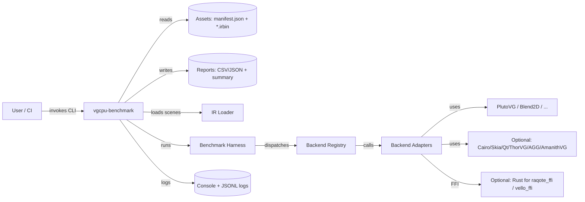
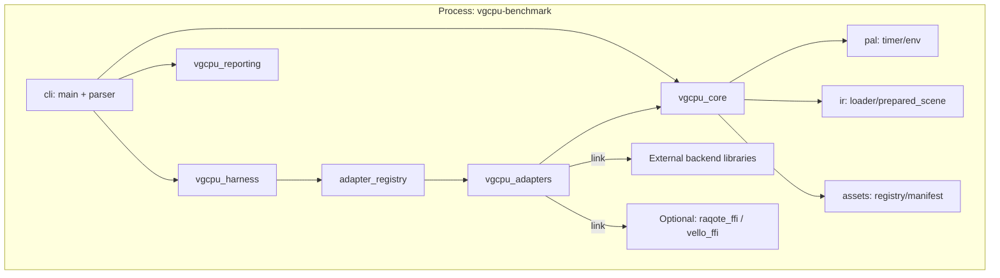
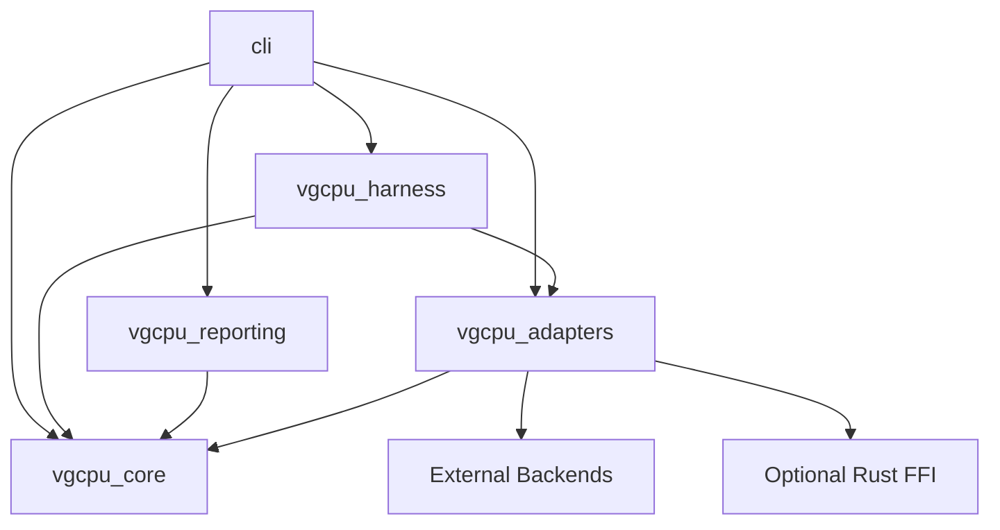

# Chapter 2 — System Architecture (C4 + Platform/Repo/Packaging)

## [ARCH-01] Architecture overview
- [ARCH-01-01] VGCPU-Benchmark is a layered CLI application with internal static libraries:
  - `vgcpu_core` (PAL + IR + assets + common types)
  - `vgcpu_adapters` (backend adapters + adapter registry)
  - `vgcpu_harness` (benchmark orchestration + statistics)
  - `vgcpu_reporting` (CSV/JSON/summary writers)
  - `vgcpu-benchmark` (CLI entrypoint)
- [ARCH-01-02] External backends are compiled/linked in as build-time selectable dependencies (C/C++ libs and optional Rust crates via Corrosion).
- [DEC-ARCH-01] Treat all `vgcpu_*` libraries as **internal implementation** (no stable external ABI promise).
  - Rationale: current includes are from `/src` and targets are not structured as public SDK; stabilizing ABI would constrain evolution.
  - Alternatives: (A) ship a public SDK with exported headers; (B) provide a C API for adapters.
  - Consequences: we enforce “internal-only” via include layout + visibility rules in Ch4/Ch7.

## [ARCH-02] C4 — System context

* [ARCH-02-01] The user supplies run parameters (backend selection, scene selection, iteration counts, output path).
* [ARCH-02-02] The system reads scene assets from the local filesystem and writes reports back to the filesystem.
* [ARCH-02-03] No network services are required (out of scope per [SCOPE-04]).

## [ARCH-03] C4 — Container view (in-process)

* [ARCH-03-01] All containers are compiled into one executable (default).
* [DEC-ARCH-02] Keep **single-process, single-executable** architecture; do not introduce plugin DLLs/SOs in v0.2.0.

  * Rationale: simplest cross-platform distribution; avoids ABI/plugin security complexities.
  * Alternatives: runtime plugin loading per backend.
  * Consequences: adding a backend requires rebuild; optional backends remain build-time toggles (see Ch7).

## [ARCH-04] Layering & dependency boundaries

* [ARCH-04-01] Allowed dependency direction (top → bottom):

  * `cli` → (`harness`, `reporting`, `adapters`, `core`)
  * `harness` → (`adapters`, `core`)
  * `reporting` → (`core`)
  * `adapters` → (`core`, external backend libs, optional rust ffi)
  * `core` → (PAL + IR + assets + common; plus data-only deps like JSON)
* [DEC-ARCH-03] “core” MUST NOT depend on any rendering backend libraries.

  * Rationale: keeps IR/assets/harness reusable and testable without heavy deps.
  * Alternatives: allow backends to leak into core.
  * Consequences: adapter interfaces must be expressive enough to isolate backends (Ch4).

### Allowed deps DAG (authoritative)

## [ARCH-05] Platform matrix

### [REQ-16] Platform support matrix MUST be explicit and CI-enforced for Tier-1 backends

| OS            | Arch         | Toolchain baseline | Tier-1 backends        | Notes                                                                 |
| ------------- | ------------ | ------------------ | ---------------------- | --------------------------------------------------------------------- |
| Windows 10/11 | x86_64       | MSVC 2022          | null, plutovg, blend2d | Optional backends may require prebuilt DLL handling (Cairo/AmanithVG) |
| macOS 13+     | x86_64/arm64 | AppleClang (Xcode) | null, plutovg, blend2d | Homebrew deps for optional backends in CI                             |
| Linux (glibc) | x86_64       | Clang/GCC          | null, plutovg, blend2d | System packages for cairo/qt6/freetype/fontconfig optional            |

* [DEC-ARCH-04] Treat **Rust-backed adapters** as optional and not Tier-1 by default (aligned with [META-03-05]).

  * Rationale: adds Rust toolchain constraints and increases CI variability.
  * Alternatives: make Raqote/Vello Tier-1.
  * Consequences: Ch7 will define feature flags + CI job matrix toggles.

## [ARCH-06] Repository artifact map (current → canonical)

### Current observed top-level layout (from archive)

* [ARCH-06-01] `/src` — implementation (core, adapters, harness, reporting, cli)
* [ARCH-06-02] `/assets` — scenes + manifest
* [ARCH-06-03] `/rust_bridge` — Rust workspace for FFI crates
* [ARCH-06-04] `/scripts`, `/tools` — helper scripts
* [ARCH-06-05] `/.github/workflows` — CI + release
* [ARCH-06-06] `/blueprint` — **legacy design docs** (conflicts with required canonical blueprint dir)

### [DEC-ARCH-05] Canonical repo layout for modernization

* [DEC-ARCH-05-01] Move existing `/blueprint` to `/docs/legacy_blueprint` (preserve history/content).
* [DEC-ARCH-05-02] Create canonical `/blueprint` per this blueprint set:

  * `blueprint_v1.0_ch*.md`, `decision_log.md`, `walkthrough.md`, `implementation_checklist.yaml`
* Consequences:

  * CI and contributors must treat `/blueprint` as source-of-truth for architecture and change governance (Ch9).

### Build targets → code ownership map

| Target            | Type       | Owns                                                  | Depends on                                                              |
| ----------------- | ---------- | ----------------------------------------------------- | ----------------------------------------------------------------------- |
| `vgcpu_core`      | static lib | PAL, IR loader, assets registry, common status/result | `nlohmann_json`                                                         |
| `vgcpu_adapters`  | static lib | adapter registry + backend adapters                   | `vgcpu_core` + enabled backend libs + optional `raqote_ffi`/`vello_ffi` |
| `vgcpu_harness`   | static lib | run orchestration + statistics                        | `vgcpu_core`, `vgcpu_adapters`                                          |
| `vgcpu_reporting` | static lib | CSV/JSON/summary writers                              | `vgcpu_core`                                                            |
| `vgcpu-benchmark` | exe        | CLI flags + command dispatch                          | all above                                                               |

## [ARCH-07] Packaging & distribution

### Current packaging (observed in CI/release workflows)

* [ARCH-07-01] Release artifacts include:

  * `package/bin/vgcpu-benchmark[.exe]`
  * `package/assets/**`
  * `package/README.md`
  * checksums file (SHA-256)
* [REQ-17] Release archives MUST be self-contained for Tier-1 backends:

  * [REQ-17-01] running the CLI without extra files beyond the archive must work (assets included).
  * [REQ-17-02] if a backend requires runtime DLLs/SOs, packaging must include them or clearly disable that backend.

### [DEC-ARCH-06] Distribution policy for optional runtime dependencies

* [DEC-ARCH-06-01] Tier-1 backends MUST NOT require extra runtime installs (beyond OS default).
* [DEC-ARCH-06-02] Optional backends may:

  * be excluded from release builds, OR
  * be included only when their runtime dependencies are bundled legally and reliably.
* Consequences:

  * Ch7 will define presets `release-tier1` and `release-full` (best-effort) and CI will publish Tier-1 by default.

## [ARCH-08] Quality attributes (system-level)

* [ARCH-08-01] Portability: isolate OS specifics in `pal/*`.
* [ARCH-08-02] Reproducibility: pin dependencies and make “enabled backends” an explicit build/runtime report field.
* [ARCH-08-03] Testability: keep IR/assets parsing and stats math backend-free and unit-testable.
* [ARCH-08-04] Benchmark integrity: strictly avoid logging/allocations in the measured hot path (detailed in Ch5/Ch6).
* [ARCH-08-05] Failure isolation: adapter failures should be contained and reported as structured errors without crashing the process (Ch4 error contracts).

## [ARCH-09] Traceability notes

* [ARCH-09-01] [REQ-01..17] in Ch1 map onto:

  * build/presets + CI gates (Ch7),
  * adapter/harness/reporting APIs and contracts (Ch4),
  * memory and hot path rules (Ch5),
  * concurrency/determinism rules (Ch6),
  * tests and benchmarks (Ch7/Ch9),
  * checklist tasks (implementation_checklist.yaml).
